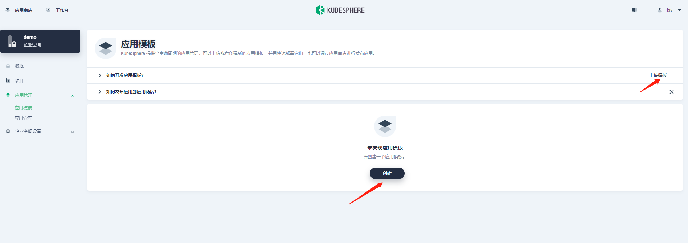
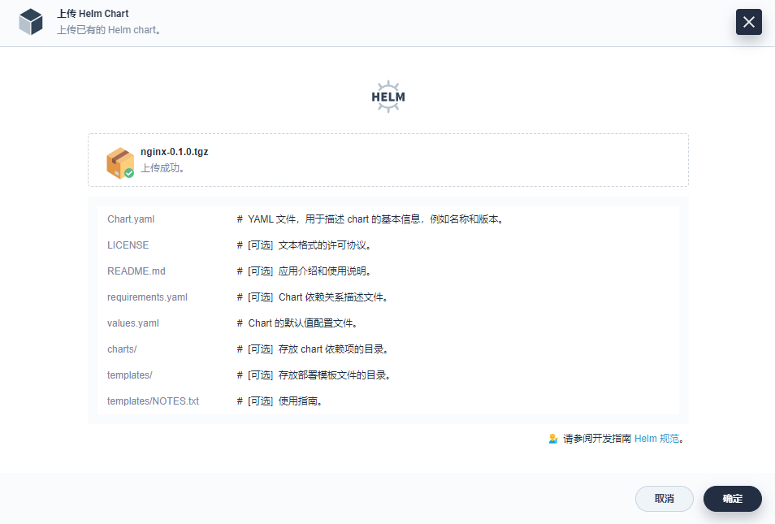
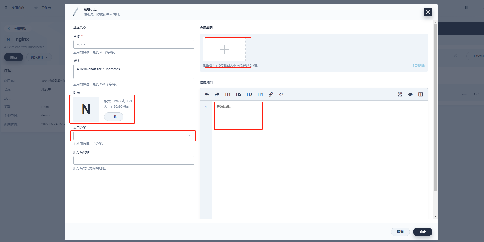

# 应用商店
[KubeSphere](https://github.com/kubesphere/kubesphere) 基于开源项目 [OpenPitrix](https://openpitrix.io/) 构建了应用商店与应用的生命周期管理，并且在 v3.2.1 中提供了 3种应用的快速部署方式：
### 1.平台全局的应用商店，提供给所有用户访问和快速部署，支持应用的生命周期管理
### 2.[应用模板](https://v2-1.docs.kubesphere.io/docs/zh-CN/quick-start/one-click-deploy/)，来自企业空间下的由 ISV 上传的应用，或导入的私有或公有的 Helm 应用仓库
### 3.[自制应用](https://v2-1.docs.kubesphere.io/docs/zh-CN/quick-start/wordpress-deployment/)，即通过资源编排的方式将多个微服务快速构建成一个完整的应用

KubeSphere 应用商店 对内可作为团队间共享企业内部的中间件、大数据、业务应用等，以应用模板的形式方便用户快速地一键部署常用的应用到 Kubernetes 中；对外可作为根据行业特性构建行业交付标准、交付流程和交付路径的基础，作为行业通用的应用商店，可根据不同需求应对不同的业务场景。
本文将介绍 KubeSphere 支持的 第一种方式 — 应用商店与应用的生命周期管理，使用nginx作为示例应用，演示应用的 上传提交、应用审核、测试部署、应用上架、应用升级、应用下架 这样一个完整的业务流程。

## 前提条件
### 已安装了 OpenPitrix（应用商店）功能组件 [可参考](https://kubesphere.com.cn/docs/pluggable-components/app-store/)
### 已创建了企业空间和项目 [管理员快速入门](https://kubesphere.com.cn/docs/access-control-and-account-management/multi-tenancy-in-kubesphere/)

## 创建自定义角色与账号
### 1.分别创建一个 workspace-admin (作为 ISV) 和一个 reviewer (作为技术审核，自定义的角色) 的账号，这两个账号在集群层级授予 platform-regular权限
提示：自定义的技术审核角色，需要在 平台角色下新建一个 app-review的角色，权限仅勾选 应用管理，然后基于该角色创建一个 reviewer 的账号。提示：自定义的技术审核角色，需要在 平台角色下新建一个 app-review的角色，权限仅勾选 应用管理，然后基于该角色创建一个 reviewer 的账号。

### 2.使用 admin 账号将以上新建的两个账号 (ISV 和 reviewer)，邀请至已创建的企业空间和项目中，并授予 workspace-admin权限。

## 上传应用提交审核
### 1.切换至 ISV 账号 workspace-admin 登录，进入企业空间下，准备上传一个示例应用并提交审核。请下载 [nginx-0.1.0](https://kubesphere.com.cn/files/application-templates/nginx-0.1.0.tgz) 打包好的第一个版本 Chart，用于 初次提交审核。
提示：示例中由于上传应用的权限仅开放给了 workspace-admin 角色，因此项目下的应用开发者需线下将打包好的 Helm 应用包传递给 ISV，由 ISV 上传应用至企业空间下的应用模板

### 2.在示例企业空间 demo-workspace下，选择 应用模板 → 上传模板。
### 3.点击 开始上传，然后将 nginx-0.1.0.tgz上传至平台。

### 4.点击确定.完成后，应用已成功上传到了企业空间下的应用模板，此时应用状态为 开发中。

### 5.在列表中点击进入nginx应用，点击左侧的 编辑信息，完善应用的介绍、应用截图、应用介绍、应用分类等。

### 6.当应用的基本信息完善后，点击展开待提交的应用，ISV 可以对该应用进行 测试安装。

### 7.点击安装，注意，在界面下方，可以根据您实际的项目名称选择不同的namespace进行部署。

### 7.1大概几分钟后，在 部署实例Tab 下，可以看到测试部署的应用当前运行状态，显示绿色即表示应用被成功部署至 Kubernetes。

### 8.点击 提交审核，确认应用已经通过了基本功能的测试，下一步在更新日志中可以按需编辑当前应用版本的版本号和更新日志。点击 确定完成应用的提交审核

### 8.1应用审核进度状态为已提交

## 审核应用
### 1.切换 reviewer账号登录 KubeSphere，进入平台管理→ 应用商店管理，选择应用发布，可以看到待发布一栏已收到了ISV提交审核的nginx应用。

### 2.reviewer 可以在 应用分类下根据业务需要，创建多个应用类型，应用分类最终将作为标签，为应用商店筛选不同类型的应用，例如 大数据、消息队列、中间件。如下，点击 +创建一个demo的应用分类。

## 应用上架
### 1.切换 ISV账号登录，进入企业空间下找到提交审核的nginx应用，在该应用的详情页即可看到 发布至应用商店的选项，点击 发布至应用商店，然后点击 确定，应用将上架到应用商店。

### 2.nginx应用的状态为已上架，意味着平台的所有用户都可以访问和部署该应用至 Kubernetes。点击在商店查看跳转至应用商店。

### 3.在应用商店的demo分类下，即可看到已上架的nginx

## 添加新版本
### KubeSphere支持对已上架的应用发布新的版本，方便用户进行升级。继续使用ISV账号，在应用模板中进入nginx应用详情页，在右侧点击添加版本，然后上传示例应用 EMQ X 的新版本

### 添加新版本后，应用新版本的审核与上架流程与上述步骤类似，本文不作赘述。
## 查看新版本
### 待应用的新版本通过reviewer审核后，即可在应用商店访问nginx应用的新版本。

