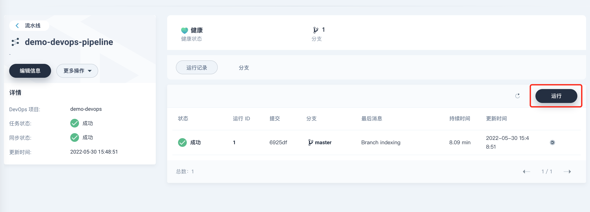
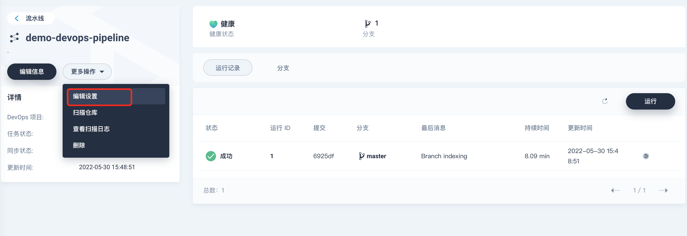

# 基于 Spring Boot 项目构建流水线

本文档介绍了如何在 KubeSphere 下通过 Jenkins 流水线自动化部署一个 SpringBoot 的项目。

Jenkinsfile in SCM 意为将 Jenkinsfile 文件本身作为源代码管理 (Source Control Management) 的一部分，根据该文件内的流水线配置信息快速构建工程内的 CI/CD 功能模块，比如阶段 (Stage)，步骤 (Step) 和任务 (Job)。因此，在代码仓库中应包含 Jenkinsfile。

## 前提条件

- 开启安装了 DevOps 功能组件，参考 [安装 DevOps 系统]()
- 本示例以 GitHub 和 DockerHub 为例，参考前确保已创建了 [GitHub](https://github.com/) 和 [DockerHub](http://www.dockerhub.com/) 账号；
- 已创建了企业空间和 DevOps 工程并且创建了项目普通用户 project-regular 的账号，若还未创建请参考 [多租户管理快速入门]()；
- 使用项目管理员 `project-admin`邀请项目普通用户 `project-regular`加入 DevOps 工程并授予 `maintainer`角色，若还未邀请请参考 [多租户管理快速入门 - 邀请成员]()。
- 了解 Jenkinsfile 的基本编写，如若不太理解，可以先通过 [图形化构建流水线]() 以及 [Jenkins官网](https://www.jenkins.io/zh/doc/book/pipeline/jenkinsfile/) 进行学习。

## 流程说明

### 第一步 平台准备

1. 选择企业空间下的项目，创建新的项目，名称根据需求进行设置，本文档使用 demo-devops-java-sample 作为项目的名称，别名与描述均可自定义填写，点击确定创建项目。

   

   

   

2. 选择企业空间下的 DevOps 项目，创建新的 DevOps 项目，名称根据需求进行设置，本文档使用 demo-devops 作为 DevOps 项目的名称，别名与描述均可自定义填写，点击确定创建项目。创建完成后进入项目。

   

   

   

   

   

3. 选择凭证，创建新的凭证，用于部署项目到平台上。名称根据需求自定义，本文档使用的是 demo-delopy-certificate ；类型为 kubeconfig ；内容不用更改，默认即可；描述可自定义，可用于说明凭证具体内容。

   

4. 创建新的凭证，用于拉取 github 项目。名称根据需求自定义，本文档使用的是 demo-github-certificate ；类型为用户名和密码；因为本文档使用的是 github ，所以根据自己的 github 账号和令牌(**这里需要说明，在 Github 下使用的是Token验证，不是常规的登录密码，请在 Github 下创建自己的Token。**[Token创建地址](https://github.com/settings/tokens/new?scopes=repo,read:user,user:email,write:repo_hook))，进行相对应的填写。如果使用的是 gitee 或者其他第三方的代码仓库，也可按照要求填写对应代码仓库使用的账号密码。描述可自定义，可用于说明凭证具体内容。

   

5. 创建新的凭证，用于上传镜像到对应的镜像仓库。名称根据需求自定义，本文档使用的是 demo-dockerhub-certificate ；类型为用户名和密码；因为本文档使用的是 DockerHub ，所以根据自己的 DockerHub 账号和密码，进行相对应的填写。如果使用的是阿里云镜像仓库或者其他第三方的镜像仓库，也可按照要求填写对应镜像仓库使用的账号密码。描述可自定义，可用于说明凭证具体内容。

   

### 第二步 代码准备

本文档使用的是测试项目 [kubesphere-springboot-devops-sample](https://github.com/cqiang1993/kubesphere-springboot-devops-sample) ，开发人员可根据自己的项目，进行代码准备。

1. fork 测试项目到自己的代码仓库

   

2. 回到自己的代码仓库打开， kubesphere-springboot-devops-sample 项目，并且找到 jenkins/Jenkinsfile-dev 这个文件。

   

3. 编辑 Jenkinsfile-dev 这个文件，根据第一步创建的凭证名称和项目，修改其中的 environment 里面的内容

   

   environment 参数说明

   | 修改项                   | 值                     | 含义                                                         | 测试名称                   |
   | ------------------------ | ---------------------- | ------------------------------------------------------------ | :------------------------- |
   | DOCKER_CREDENTIAL_ID     | dockerhub-id           | 填写创建凭证步骤中的 DockerHub 凭证 ID，用于登录您的 DockerHub | demo-dockerhub-certificate |
   | GITHUB_CREDENTIAL_ID     | github-id              | 填写创建凭证步骤中的 GitHub 凭证 ID，用于推送 tag 到 GitHub 仓库 | demo-github-certificate    |
   | KUBECONFIG_CREDENTIAL_ID | demo-kubeconfig        | kubeconfig 凭证 ID，用于访问接入正在运行的 Kubernetes 集群   | demo-delopy-certificate    |
   | REGISTRY                 | docker.io              | 默认为 docker.io 域名，用于镜像的推送                        | 默认值                     |
   | DOCKERHUB_NAMESPACE      | your-dockerhub-account | 替换为您的 DockerHub 账号名 (它也可以是账户下的 Organization 名称) |                            |
   | GITHUB_ACCOUNT           | your-github-account    | 替换为您的 GitHub 账号名，例如 `https://github.com/kubesphere/`则填写 `kubesphere`(它也可以是账户下的 Organization 名称) |                            |
   | APP_NAME                 | devops-java-sample     | 应用名称                                                     |                            |

   内容参照(附，jenkinsfile流程说明)：

   ```jenkinsfile
   pipeline {
       agent { 
           node {
               label 'maven'  // 使用 maven 创建一个用于构建的代理节点
           }
       }
   
       parameters {
           string(name:'TAG_NAME',defaultValue: '',description:'')  // 传参设置 
       }
   
       environment {
           DOCKER_CREDENTIAL_ID = 'demo-dockerhub-certificate'  // 使用第一步的 dockerhub 凭证名称，可以根据自己的设置修改
           GITHUB_CREDENTIAL_ID = 'demo-github-certificate' // 使用第一步的 github 凭证名称，可以根据自己的设置修改
           KUBECONFIG_CREDENTIAL_ID = 'demo-deploy-certificate' // 使用第一步的 kubeconfig 凭证名称，可以根据自己的设置修改
           REGISTRY = 'docker.io' // 默认使用 dockerhub 的仓库地址，可以根据需求改为自己的仓库地址，例如阿里云，青云之类的
           DOCKERHUB_NAMESPACE = 'cqiang1993' // dockerhub 的仓库名称
           GITHUB_ACCOUNT = 'cqiang1993' // 自己的 github 的账号名称
           APP_NAME = 'kubesphere-springboot-devops-sample' // 应用名称可自定义
       }
       // $+environment 里面的值就可以取出上面环境变量
       stages {
           stage ('checkout scm') {   // 流程第一步，拉取源代码
               steps {
                   checkout(scm)
               }
           }
   
           stage ('build target && make docker image') { // 流程第二步，构建 jar 包和生成 docker 容器镜像
               steps {
                   container ('maven') { // 使用 maven 容器
                       sh 'mvn clean package' // 使用 mvn 打包 springboot 项目
                       sh 'docker build -f build/Dockerfile-dev -t $REGISTRY/$DOCKERHUB_NAMESPACE/$APP_NAME:SNAPSHOT-$BRANCH_NAME-$BUILD_NUMBER .' // 制作版本镜像
                   }
               }
           }
   
           stage('push image to dockerhub'){ // 流程第三步，推送镜像到镜像仓库
               when{  // 如果当前分支是 master 则进行后面的操作
                   branch 'master'
               }
               steps{
                   container ('maven') {
                       withCredentials([usernamePassword(passwordVariable : 'DOCKER_PASSWORD' ,usernameVariable : 'DOCKER_USERNAME' ,credentialsId : "$DOCKER_CREDENTIAL_ID" ,)]) {  // 使用凭证
                           sh 'docker tag  $REGISTRY/$DOCKERHUB_NAMESPACE/$APP_NAME:SNAPSHOT-$BRANCH_NAME-$BUILD_NUMBER $REGISTRY/$DOCKERHUB_NAMESPACE/$APP_NAME:latest' // 为镜像打上 latest 标签
                           sh 'echo "$DOCKER_PASSWORD" | docker login $REGISTRY -u "$DOCKER_USERNAME" --password-stdin' // 使用凭证登录 dockerhub 仓库
                           sh 'docker push  $REGISTRY/$DOCKERHUB_NAMESPACE/$APP_NAME:SNAPSHOT-$BRANCH_NAME-$BUILD_NUMBER' // 推送版本镜像
                           sh 'docker push  $REGISTRY/$DOCKERHUB_NAMESPACE/$APP_NAME:latest' // 推送 latest 镜像
                       }
                   }
   
               }
           }
   
           stage('deploy to dev') {  // 流程第四步，部署项目到 kubesphere 平台上
               agent {
                   node {
                       label 'base' // 使用 base 创建一个用于部署的代理节点
                   }
               }
               when{ // 如果当前分支是 master 则进行后面的操作
                   branch 'master'
               }
               steps {
                   container('base'){ // 使用 base 容器
                       input(id: 'deploy-to-dev', message: 'deploy to dev?') // 中断等待是否部署的指令输入
                       withCredentials([kubeconfigFile(credentialsId : "$KUBECONFIG_CREDENTIAL_ID" ,variable : 'KUBECONFIG')]) { // 使用 kubeconfig 凭证部署
                           sh 'envsubst < deploy/dev-deploy.yaml |kubectl apply -f -' // 将环境变量替换并使用 kubectl 部署
                       }
                   }
               }
           }
       }
   }
   ```

   

4. 找到 deploy 目录下的 dev-deploy 文件，并且进行相对应的修改

   

   ```yaml
   kind: Deployment
   apiVersion: apps/v1
   metadata:
     name: kubesphere # 应用名称可自行设置
     namespace: demo-devops-java-sample # 根据第一步创建的项目名称进行设置
     labels:
       app: kubesphere # 应用名称可自行设置
     annotations:
       deployment.kubernetes.io/revision: '1'
       kubesphere.io/creator: ******* # 指定成自己当前使用的 kubesphere 的平台的账号名称
   spec:
     replicas: 1
     selector:
       matchLabels:
         app: kubesphere # 应用名称可自行设置
     template:
       metadata:
         labels:
           app: kubesphere # 应用名称可自行设置
       spec:
         volumes:
           - name: host-time
             hostPath:
               path: /etc/localtime
               type: ''
         containers:
           - name: kubesphere
             image: "$REGISTRY/$DOCKERHUB_NAMESPACE/$APP_NAME:SNAPSHOT-$BRANCH_NAME-$BUILD_NUMBER"
             ports:
               - name: http-8080
                 containerPort: 8080
                 protocol: TCP
             env:
               - name: CACHE_IGNORE
                 value: js|html
               - name: CACHE_PUBLIC_EXPIRATION
                 value: 3d
             resources:
               limits:
                 cpu: 300m
                 memory: 600Mi
               requests:
                 cpu: 100m
                 memory: 100Mi
             volumeMounts:
               - name: host-time
                 readOnly: true
                 mountPath: /etc/localtime
             readinessProbe:
               httpGet:
                 path: /
                 port: 8080
                 scheme: HTTP
               timeoutSeconds: 10
               periodSeconds: 5
               successThreshold: 1
               failureThreshold: 30
             terminationMessagePath: /dev/termination-log
             terminationMessagePolicy: File
             imagePullPolicy: Always
         restartPolicy: Always
         terminationGracePeriodSeconds: 30
         dnsPolicy: ClusterFirst
         serviceAccountName: default
         serviceAccount: default
         securityContext: {}
         schedulerName: default-scheduler
     strategy:
       type: RollingUpdate
       rollingUpdate:
         maxUnavailable: 25%
         maxSurge: 25%
     revisionHistoryLimit: 10
     progressDeadlineSeconds: 600
   ---
   apiVersion: v1
   kind: Service
   metadata:
     namespace: demo-devops-java-sample  # 根据第一步创建的项目名称进行设置
     labels:
       app: kubesphere-svc # 服务名称可自行设置
     name: kubesphere-svc # 服务名称可自行设置
   spec:
     sessionAffinity: None
     selector:
       app: kubesphere # 应用名称可自行设置
     ports:
       - name: http-8080
         protocol: TCP
         targetPort: 8080
         port: 8080
         nodePort: 30861
     type: NodePort
   
   ```

   

### 第三步 创建流水线

1. 新建一条流水线，输入名称，本文档使用的是demo-devops-pipeline

   

2. 点击代码仓库，选择 Github 仓库，选择前面创建的 demo-github-certificate 凭证，点击确定

   

3. 等待加载完成之后，选择前面同步过来代码的组织和项目，本文档使用的是 kubesphere-springboot-devops-sample 项目，开发者可以根据自己的项目去选择，完成后点击下一步

   

4. 修改 Jenkinsfile 的路径，根据项目里面存放 Jenkinsfile 的路径和文件名称，去设置路径，本文档使用的是 jenkins 目录下的文件，所以路径为 jenkins/Jenkinsfile-dev ，点击创建

   

   

### 第四步 运行流水线

1. 进入 demo-devops-pipeline 这个流水线工程 ( 首次进入流水线会自动运行扫描分支的操作 ) 

   

   

2. 主动触发流水线，选择更多操作下的扫描仓库，或者进入对应分支下点击运行

   

   

   

3. 如果想要多个分支运行多个分支，可以通过流水线主界面上的运行可直接运行

   

4. 如果需要进行提交代码后自动运行流水线，进入编辑设置，复制 Webhook 的地址，在对应 Github 仓库下面的 Setting 里面，找到 Webhook 进行添加。之后代码在提交到仓库的时候，就会自动运行 KubeSphere 的流水线进行自动化构建

   

   

   

### 第五步 验证结果

1. 流水线执行成功

   

2. 回到前面创建的项目 demo-devops-java-sample 发现容器数量由原来的 0 变成 1 。

   

3. 进入容器查看对应的工作负载和服务

   

   

4. 服务设置了 NodePort 的端口为 30861 ，可以通过所在服务器的 30861 端口进行访问验证，看到 Hello KubeSphere 说明自动部署成功

   

