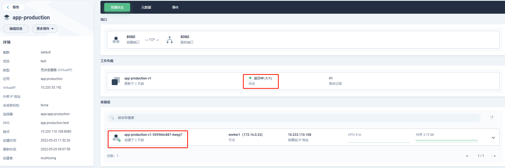
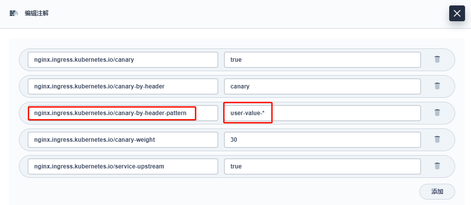

# 使用 Ingress-Nginx 进行灰度发布
在[Ingress-Nginx (0.21.0 版本)](https://github.com/kubernetes/ingress-nginx/releases/tag/nginx-0.21.0)中，引入了一个新的`Canary`功能，可用于为网关入口配置多个后端服务，还可以使用指定的`annotation`来控制多个后端服务之间的流量分配。 `KubeSphere` 在 [3.2.1](https://kubesphere.io/zh/docs/) 的版本 中，升级了项目网关 (Ingress Controller) 版本至 `v0.48.1`，支持基于[Ingress-Nginx](https://kubernetes.github.io/ingress-nginx/user-guide/nginx-configuration/annotations/#canary)的灰度发布。

## Ingress-Nginx Annotation 简介
KubeSphere 基于[Nginx Ingress Controller](https://github.com/kubernetes/ingress-nginx/#nginx-ingress-controller)实现了项目的网关，作为项目对外的流量入口和项目中各个服务的反向代理。而 Ingress-Nginx 支持配置 Ingress Annotations 来实现不同场景下的灰度发布和测试，可以满足`金丝雀发布`、`蓝绿部署`与 `A/B 测试`等业务场景。

> **Nginx Annotations 支持以下 5 种 Canary 规则：**
> 
> - `nginx.ingress.kubernetes.io/canary-by-header`：基于 Request Header 的流量切分，适用于`灰度发布以及 A/B 测试`。当 Request Header 设置为 `always`时，请求将会被`一直`发送到 Canary 版本；当 Request Header 设置为 `never`时，请求`不会`被发送到 Canary 入口；对于任何其他 `Header` 值，将忽略 `Header`，并通过优先级将请求与其他金丝雀规则进行优先级的比较。
> - `nginx.ingress.kubernetes.io/canary-by-header-value`：要匹配的 Request Header 的值，用于通知 `Ingress` 将请求路由到 `Canary Ingress `中指定的服务。当 `Request Header` 设置为此值时，它将被路由到 Canary 入口。该规则允许用户自定义 Request Header 的值，必须与上一个 annotation (即：`canary-by-header`) 一起使用。
> - `nginx.ingress.kubernetes.io/canary-by-header-pattern`：要匹配的 Request Header 值的PCRE正则表达式，作用同上面的`canary-by-header-value`一样，当 `Request Header` 设置的值满足该正则表达式时，它将被路由到 Canary 入口，必须与`canary-by-header`一起使用。
> - `nginx.ingress.kubernetes.io/canary-weight`：基于服务权重的流量切分，适用于蓝绿部署，权重范围 `0` - `100`按百分比将请求路由到 `Canary Ingress` 中指定的服务。权重为 `0` 意味着该金丝雀规则不会向 Canary 入口的服务发送任何请求，权重为 `100` 意味着所有请求都将被发送到 Canary 入口。
> - `nginx.ingress.kubernetes.io/canary-by-cookie`：基于 `cookie` 的流量切分，适用于`灰度发布与 A/B 测试`。用于通知 Ingress 将请求路由到` Canary Ingress `中指定的服务的`cookie`。当 `cookie` 值设置为 `always`时，它将被路由到 Canary 入口；当 cookie 值设置为 `never`时，请求不会被发送到 Canary 入口；对于任何其他值，将忽略 cookie 并将请求与其他金丝雀规则进行优先级的比较。
> 
> **注意：金丝雀规则按优先顺序进行如下排序：**
> 
> `canary-by-header` - > `canary-by-cookie` - > `canary-weight`

把以上的五个`annotation`规则可以总体划分为以下两类：
- 基于权重的 Canary 规则

- 基于用户请求的 Canary 规则


## 前提条件
- 准备`kubesphere v3.2.1`集群，如果没有可以参考[快速入门](https://kubesphere.io/zh/docs/quick-start/)快速搭建一个测试集群。
- 开启项目网关或者集群网关，具体参考文档[项目网关](https://kubesphere.io/zh/docs/project-administration/project-gateway/)。
- 使用`project-admin`登录创建测试项目`test`并进入该项目工作空间，具体可以参考入门必读[1. 多租户管理快速入门]()。

## 测试镜像说明
本章节内容以`hub.deri.org.cn/library/test-ingress-nginx-canary`镜像为后端服务，`v1`版本为生产版本，`v2`版本为灰度测试版本。两个镜像查询版本的`/version`接口返回内容是不一样的。
```bash
# v1版本接口返回内容
this is version 1.
# v2版本接口返回内容
this is version 2.
```

## 第一步：网关设置
进入到`test`项目空间，打开`网关设置`：

> 网关这里采用`NodePort`方式暴露测试，注意`HTTP`端口号：`31897`，后面的服务请求都是通过这个端口。

## 第二步：创建Production版本的应用
- 选择`服务`，点击`创建`

- 选择`无状态服务`

- 输入`名称`

- 下一步，`添加容器`

- 输入测试镜像名称`hub.deri.org.cn/library/test-ingress-nginx-canary:v1`，回车，选择`使用默认端口`，点击右下角`√`

- `容器组设置`其余配置选择默认，点击`下一步`
- `存储卷设置`选择默认，点击`下一步`
- `高级设置`选择默认，点击`创建`
- 创建完成，可以看到`service`的`ClusterIP`是`10.233.53.192`

- 点击刚刚创建的服务名`app-production`查看服务详情，确认服务运行正常

- 可以在集群内部节点上通过命令测试
```bash
[root@master1 ~]# curl 10.233.53.192:8080/version
this is version 1.
```
> 也可以将`service`改为`type: NodePort`方式暴露到集群外访问测试，在`kubesphere`上选择服务的`编辑外部访问`即可，此处不在演示。

## 第三步：创建Canary版本
- 参考[第二步：创建Production版本的应用](/ingress-canary/index.html#第二步创建production版本的应用)步骤创建`Canary`版本应用，注意镜像选择`hub.deri.org.cn/library/test-ingress-nginx-canary:v2`
- 创建完成，可以看到两个服务：`app-production`和`app-canary`


## 第四步：创建Production应用路由
- 选择`应用路由`，点击`创建`

- 输入`名称`：`ingress-production`，点击`下一步`

- 点击`添加路由规则`

- 配置`路由规则`，选择指定域名，输入测试域名`kubesphere.io`，协议使用`HTTP`，路径中服务选择`app-production`，端口选择服务端口`8080`

> 生产环境协议建议使用`HTTPS`，服务和端口配置实际业务的`名称`和`端口号`。
- 点击右下角`√`确定配置，点击`下一步`

- 应用路由高级配置使用默认配置，点击`创建`
- 创建完成后刷新页面，就能看到刚刚创建的`应用路由`及分配的`网关地址`

- 点击应用路由名称进入查看详情

- 测试Production版本应用路由
```bash
# 注意，加上 --resolve 参数则无需在本地配置/etc/hosts中的IP与域名映射，否则需要预先在本地配置域名映射，其中172.16.0.23是项目内的网关地址。
[root@master1 ~]# curl --resolve kubesphere.io:31897:172.16.0.23 kubesphere.io:31897/version
this is version 1.
```

## 第五步：创建Canary应用路由
> 注意：要开启`Ingress-Nginx`灰度发布机制，首先需设置`nginx.ingress.kubernetes.io/canary: "true"`启用`Canary`，具体通过相关`Annotation`规则配置。

配置`Canary`应用路由过程参考[第四步：创建Production应用路由](/ingress-canary/index.html#第四步创建production应用路由)，注意以下几点：
- 配置`路由规则`，选择指定域名，输入测试域名`kubesphere.io`，协议使用`HTTP`，路径中服务选择`app-canary`，端口选择服务端口`8080`

- 应用路由`高级配置`，选择`添加元数据`

- 在`注解`右下角点击`添加`，左边输入`nginx.ingress.kubernetes.io/canary`，右边输入`true`，开启`Canary`

> 其余`Annotation`规则根据你采用的灰度发布规则来使用。
- 点击创建，此时可以看到2个应用路由


### 基于权重 (Weight)
基于权重的流量切分的典型应用场景就是`蓝绿部署`，可通过将权重设置为`0`或`100`来实现。例如，可将`Green`版本设置为主要部分，并将`Blue`版本的入口配置为`Canary`。最初，将权重设置为`0`，因此不会将流量代理到`Blue`版本。一旦新版本测试和验证都成功后，即可将`Blue`版本的权重设置为`100`，即所有流量从`Green`版本转向`Blue`。
- 在`第五步：创建Canary应用路由`，高级配置中添加注解
- 在`注解`右下角点击`添加`，左边输入`nginx.ingress.kubernetes.io/canary-weight`，右边输入`0`~`100`的权重，开启基于权重的灰度发布

> 注意：默认总权重为`100`，可以通过注解`nginx.ingress.kubernetes.io/canary-weight-total`修改成其他值。
如上图，将`Canary`版本权重设置为`0`，及所有的请求都不流入`Canary`版本。我们使用命令测试
```bash
# 返回结果全是this is version 1.证明流量全部到了production版本
[root@master1 ~]# for i in $(seq 1 10); do curl -s --resolve kubesphere.io:31897:172.16.0.23 kubesphere.io:31897/version; done
this is version 1.
this is version 1.
this is version 1.
this is version 1.
this is version 1.
this is version 1.
this is version 1.
this is version 1.
this is version 1.
this is version 1.
```
- 选择应用路由`ingress-canary`，选择`编辑注解`，修改`Canary`权重为`30`，意思是将分配`30%`的流量请求发送至`Canary`版本。


- 继续使用命令测试
> 应用的`Canary`版本基于权重 (30%) 进行流量切分后，访问到`Canary`版本的概率接近 30%，流量比例可能会有小范围的浮动。
```bash
# 部分结果返回了this is version 2.证明部分流量到了canary版本
[root@master1 ~]# for i in $(seq 1 10); do curl -s --resolve kubesphere.io:31897:172.16.0.23 kubesphere.io:31897/version; done
this is version 1.
this is version 1.
this is version 2.
this is version 1.
this is version 1.
this is version 2.
this is version 1.
this is version 1.
this is version 2.
this is version 1.
```
- 将`Canary`权重修改为`100`，意思是所有流量请求发送至`Canary`版本
```bash
[root@master1 ~]# for i in $(seq 1 10); do curl -s --resolve kubesphere.io:31897:172.16.0.23 kubesphere.io:31897/version; done
this is version 2.
this is version 2.
this is version 2.
this is version 2.
this is version 2.
this is version 2.
this is version 2.
this is version 2.
this is version 2.
this is version 2.
```

### 基于Request Header
基于 `Request Header` 进行流量切分的典型应用场景即`灰度发布或 A/B 测试场景`。参考以下截图，在 `KubeSphere` 给 `Canary` 版本的应用路由 (`Ingress`) 新增一条 `annotation nginx.ingress.kubernetes.io/canary-by-header: canary(`这里的 `annotation` 的 `value` 可以是任意值)，使当前的 `Ingress` 实现基于 `Request Header` 进行流量切分。
> 说明：金丝雀规则按优先顺序 `canary-by-header` - > `canary-by-cookie` - > `canary-weight`进行如下排序，因此以下情况将忽略原有 `canary-weight` 的规则。


> 说明：
> 
> 举两个例子，如开篇提到的当`Request Header`设置为`never`或`always`时，请求将`不会`或`一直`被发送到`Canary`版本；
> 
> 对于任何其他`Header`值，将忽略`Header`，并通过优先级将请求与其他`Canary`规则进行优先级的比较（如下第二次请求已将基于`30%`权重作为第一优先级）。 

使用命令测试：
```bash
[root@master1 ~]# for i in $(seq 1 10); do curl -s -H "canary: never"  --resolve kubesphere.io:31897:172.16.0.23 kubesphere.io:31897/version; done
this is version 1.
this is version 1.
this is version 1.
this is version 1.
this is version 1.
this is version 1.
this is version 1.
this is version 1.
this is version 1.
this is version 1.
[root@master1 ~]# for i in $(seq 1 10); do curl -s -H "canary: always"  --resolve kubesphere.io:31897:172.16.0.23 kubesphere.io:31897/version; done
this is version 2.
this is version 2.
this is version 2.
this is version 2.
this is version 2.
this is version 2.
this is version 2.
this is version 2.
this is version 2.
this is version 2.
[root@master1 ~]# for i in $(seq 1 10); do curl -s -H "canary: other-value"  --resolve kubesphere.io:31897:172.16.0.23 kubesphere.io:31897/version; done
this is version 1.
this is version 2.
this is version 1.
this is version 1.
this is version 1.
this is version 2.
this is version 2.
this is version 1.
this is version 1.
this is version 1.
```
此时可以在上一个`annotation`(即`canary-by-header`）的基础上添加一条`nginx.ingress.kubernetes.io/canary-by-header-value: user-value`。用于通知`Ingress`将请求路由到`Canary Ingress`中指定的服务。

如下访问应用的域名，当`Request Header`满足此值时，所有请求被路由到`Canary`版本（该规则允许用户自定义`Request Header`的值），不满足此值时继续按照`30%`权重随机分配。
```bash
[root@master1 ~]# for i in $(seq 1 10); do curl -s -H "canary: user-value"  --resolve kubesphere.io:31897:172.16.0.23 kubesphere.io:31897/version; done
this is version 2.
this is version 2.
this is version 2.
this is version 2.
this is version 2.
this is version 2.
this is version 2.
this is version 2.
this is version 2.
this is version 2.
[root@master1 ~]# for i in $(seq 1 10); do curl -s -H "canary: other-value"  --resolve kubesphere.io:31897:172.16.0.23 kubesphere.io:31897/version; done
this is version 1.
this is version 1.
this is version 1.
this is version 1.
this is version 2.
this is version 2.
this is version 2.
this is version 2.
this is version 1.
this is version 2.
```

`canary-by-header-value`的值是支持`PCRE`正则表达式的，具体可以通过注解`nginx.ingress.kubernetes.io/canary-by-header-pattern`来设置。
> 注意：如果`canary-by-header-value`已经设置了，`canary-by-header-pattern`这个注解就会被忽略；如果正则表达式在处理的过程中出现错误也会认为不匹配。


如上图配置，Header canary的值如果满足`user-value-*`正则表达式则将流量转入`Canary`版本，负责按照`30%`权重随机分配。
```bash
[root@master1 ~]# for i in $(seq 1 10); do curl -s -H "canary: user-value-2"  --resolve kubesphere.io:31897:172.16.0.23 kubesphere.io:31897/version; done
this is version 2.
this is version 2.
this is version 2.
this is version 2.
this is version 2.
this is version 2.
this is version 2.
this is version 2.
this is version 2.
this is version 2.
[root@master1 ~]# for i in $(seq 1 10); do curl -s -H "canary: user-value-3"  --resolve kubesphere.io:31897:172.16.0.23 kubesphere.io:31897/version; done
this is version 2.
this is version 2.
this is version 2.
this is version 2.
this is version 2.
this is version 2.
this is version 2.
this is version 2.
this is version 2.
this is version 2.
[root@master1 ~]# for i in $(seq 1 10); do curl -s -H "canary: test-value"  --resolve kubesphere.io:31897:172.16.0.23 kubesphere.io:31897/version; done
this is version 2.
this is version 1.
this is version 1.
this is version 1.
this is version 1.
this is version 1.
this is version 2.
this is version 1.
this is version 1.
this is version 1.
[root@master1 ~]# for i in $(seq 1 10); do curl -s -H "canary: ce-value"  --resolve kubesphere.io:31897:172.16.0.23 kubesphere.io:31897/version; done
this is version 1.
this is version 1.
this is version 1.
this is version 2.
this is version 1.
this is version 2.
this is version 1.
this is version 1.
this is version 1.
this is version 1.
```

### 基于 Cookie
与基于`Request Header`的`annotation`用法规则类似。例如在`A/B 测试场景`下，需要让地域为北京的用户访问`Canary`版本。那么当`cookie`的`annotation`设置为`nginx.ingress.kubernetes.io/canary-by-cookie: "users_from_Beijing"`，此时后台可对登录的用户请求进行检查，如果该用户访问源来自北京则设置cookie `users_from_Beijing`的值为`always`，这样就可以确保北京的用户仅访问`Canary`版本。
```bash
[root@master1 ~]# for i in $(seq 1 10); do curl -s --cookie "users_from_Beijing=always"  --resolve kubesphere.io:31897:172.16.0.23 kubesphere.io:31897/version; done
this is version 2.
this is version 2.
this is version 2.
this is version 2.
this is version 2.
this is version 2.
this is version 2.
this is version 2.
this is version 2.
this is version 2.
[root@master1 ~]# for i in $(seq 1 10); do curl -s --cookie "users_from_Beijing=never"  --resolve kubesphere.io:31897:172.16.0.23 kubesphere.io:31897/version; done
this is version 1.
this is version 1.
this is version 1.
this is version 1.
this is version 1.
this is version 1.
this is version 1.
this is version 1.
this is version 1.
this is version 1.
[root@master1 ~]# for i in $(seq 1 10); do curl -s --cookie "users_from_Beijing=unknow"  --resolve kubesphere.io:31897:172.16.0.23 kubesphere.io:31897/version; done
this is version 1.
this is version 2.
this is version 2.
this is version 1.
this is version 1.
this is version 1.
this is version 1.
this is version 1.
this is version 1.
this is version 1.
```

## 总结
灰度发布可以保证整体系统的稳定，在初始灰度的时候就可以对新版本进行测试、发现和调整问题，以保证其影响度。本文通过多个示例演示和说明了基于`KubeSphere`使用应用路由 (`Ingress`) 和项目网关 (`Ingress Controller`) 实现灰度发布，并详细介绍了`Ingress-Nginx`的五种`Annotation`，还未使用`Istio`的用户也能借助`Ingress-Nginx`轻松实现灰度发布与金丝雀发布。

## 参考
- [NGINX Ingress Controller - Annotations](https://kubernetes.github.io/ingress-nginx/user-guide/nginx-configuration/annotations/#canary)